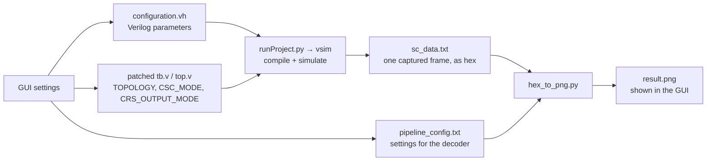
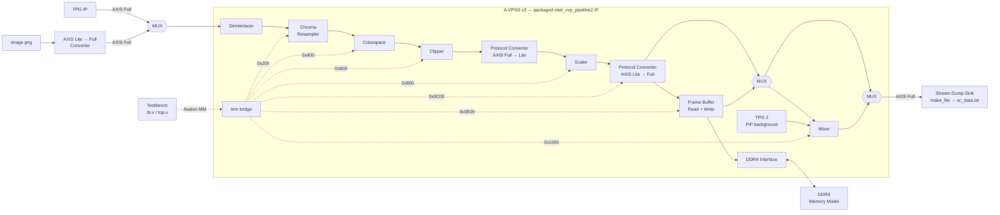

# Altera Video Processing Pipeline

A reconfigurable video processing pipeline built from Intel/Altera VVP IPs that replicates the
functionality of AMD's Video Processing Subsystem (VPSS) IP.

The end product is a **single packaged Platform Designer IP called `A-VPSS`** (Altera Video
Processing Subsystem). Instead of wiring up the individual VVP IPs
yourself, you instantiate this one IP: it carries the whole processing chain inside it, and exposes one Avalon-MM port through which every stage is configured.
In this repository it is generated as `intel_vvp_pipeline2` — see
[packaged_ip/](packaged_ip/intel_vvp_pipeline2/).

Everything is driven from a **desktop GUI**: pick a pipeline topology, set the video parameters,
press *Run Simulation*, and the app generates the RTL configuration, runs QuestaSim, and renders
the captured output frame as a PNG.

| | |
| :--- | :--- |
| | |
| Headers | Explaination |
| **Topologies** | 7 selectable datapaths:<br/>`DIL_ONLY` — Deinterlacer<br/>`CRS_ONLY` — Chroma Resampler<br/>`CSC_ONLY` — Color Space Converter<br/>`CRS_CSC` — Chroma Resampler → Color Space Converter<br/>`SCALER_ONLY` — Protocol Converter (Full→Lite) → Scaler<br/>`CLIP_SCL` — Clipper → Protocol Converter (Full→Lite) → Scaler<br/>`FULL` — Deinterlacer → Chroma Resampler → Color Space Converter → Clipper → Protocol Converter (Full→Lite) → Scaler |
| **Picture-in-Picture (PiP)** | Can be switched on with any topology. A second TPG draws a plain background picture, and the Mixer places the pipeline video on top of it as a smaller window. You choose the background size, its color, and where the small video sits |
| **Frame Rate Conversion (FRC)** | Can be switched on with any topology. Each frame is stored in external DDR4 memory through the Frame Buffer and then read back out. If the write and read speeds differ, the Frame Buffer either drops frames or repeats them — and it counts both, so you can see exactly what happened |
| **IPs integrated** | TPG, Deinterlacer, Chroma Resampler, Color Space Converter, Clipper, Protocol Converters, Scaler, Mixer (PiP), Video Frame Buffer + DDR4 EMIF |
| **Validation** | End-to-end image-level comparison, plus 9 standalone per-IP testbenches |
| **Target** | Agilex 5 (`A5ED065BB32AE6SR0`), simulation-only flow |

Validated so far: PiP with `FULL` mode, FRC (DDR4 memory model) with `SCALER_ONLY`. The
toggles are not restricted to those topologies — that is just how far testing has reached.

A detailed functional walkthrough is in [user guide.pdf](user%20guide.pdf).

---

## 1. Prerequisites

| Requirement | Version / Notes |
| :--- | :--- |
| Quartus Prime Pro | **25.1.1** (Platform Designer used for IP generation) |
| Simulator | **Questa Intel Starter FPGA Edition** bundled with Quartus (`questa_fse`) |
| Python | 3.x with **PyGObject (GTK 3)**, **OpenCV**, **NumPy** |

```bash
# Debian/Ubuntu
sudo apt install python3-gi gir1.2-gtk-3.0
pip3 install opencv-python numpy
```

> The GUI must run under the **system** Python (`/usr/bin/python3`) — a virtualenv usually
> lacks the `gi` module and the app will exit with a clear error if so.

### Tool paths

[runProject.py](Integrated_design/app/runProject.py) resolves the toolchain from the
environment and falls back to the local install path. Export these in `~/.bashrc` so moving
machines never means editing scripts:

| Variable | Meaning |
| :--- | :--- |
| `QUARTUS_INSTALL_DIR` | `<acds>/quartus` — used for `msim_setup.tcl` and `simsf_dpi.cpp` |
| `QUESTASIM_DIR` | `<acds>/questa_fse` — which `vsim` binary to call |
| `QUARTUS_ROOTDIR` | **must** be `<acds>/quartus`, not the SDK root (the DDR4/EMIF model reads it at t=0) |
| `FRC_WAVES=1` | Force waveform logging on in a headless run |
| `FRC_DEV_COM=1` | Additionally run the full `dev_com` device-library compile |

---

## 2. Quick Start

```bash
cd Integrated_design/app
python3 image_viewer.py
```

1. **Pick a topology** — e.g. `FULL` for the complete pipeline, `SCALER_ONLY` for a fast run.
2. **Choose an input source** — TPG (test pattern) or `image.png`.
3. **Set parameters** — input resolution, clipper offsets, scaler output, CRS/CSC modes,
   optional PiP and Frame Rate Conversion. Or hit **Load** on a saved preset.
4. **Run Simulation** — the app applies your settings to the RTL, runs the simulation, and turns
   the captured frame into a picture (details below).
5. **View the result** — the badge turns `READY [<topology>]` and `result.png` appears in the
   viewer with its dimensions.

Tick **Enable Debugging Mode** to launch the QuestaSim **GUI** with waveforms instead of a
headless batch run.

### What happens on "Run Simulation"



The GUI is not connected to the simulator directly — it cannot "send" values to a running
simulation. Instead it writes your settings into files that the simulator reads while
compiling, then starts the simulator. Five steps run one after another:

**1 · Write the Verilog settings file.** Your numbers (input resolution, clipper offsets,
scaler output size, PiP settings, …) are written to `app/configuration.vh` as plain Verilog
`parameter` lines. `tb.v` has an `` `include "../app/configuration.vh" `` at the top, so
recompiling picks up the new values automatically.

**2 · Patch the RTL.** A few settings cannot travel through that include file, because they are
written directly inside the RTL sources: `TOPOLOGY` in `tb.v` and `top.v`, and `CSC_MODE` and
`CRS_OUTPUT_MODE` in `top.v`. So the app opens those `.v` files, finds those lines, and rewrites
the values in place — an ordinary text find-and-replace on the source code. That edit is what
"patching the RTL" means. For example, choosing `SCALER_ONLY` in the GUI changes this line in
`tb.v`:

```verilog
localparam TOPOLOGY = "FULL";          // before
localparam TOPOLOGY = "SCALER_ONLY";   // after the patch
```

> Because these are real edits to tracked files, `tb.v` and `top.v` will show up as modified in
> `git status` after a run. That is expected — it is your last GUI selection, not an accidental
> change.

**3 · Write the decoder config.** The same settings are written again to
`app/pipeline_config.txt`, this time as simple `key = value` text, because the Python script
that renders the image needs to know the frame size and the pixel format to expect.

**4 · Run the simulation.** `runProject.py` generates a QuestaSim script (`run_sim.do`) that
compiles the Platform Designer IP and the four RTL files, then launches `vsim` — headless
(`-c`) normally, or with the GUI and waveforms (`-gui`) in debug mode. The testbench captures
one complete output frame and dumps it as hex text to `app/sc_data.txt`.

**5 · Render the picture.** `hex_to_png.py` reads `sc_data.txt`, decodes it as RGB, 4:4:4, 4:2:2
or 4:2:0 according to `pipeline_config.txt`, and saves `app/result.png` — which the GUI then
displays.

---

## 3. Repository Structure

```
altera_video_pipeline/
├── Integrated_design/          # Full end-to-end pipeline simulation
│   ├── app/                    # GTK3 control GUI, config + image conversion scripts, presets
│   ├── rtl/                    # Testbench, DUT wrapper + configuration FSM, frame capture
│   ├── platform/               # Platform Designer (Qsys) system + generated IP
│   ├── quartus/                # Quartus project (Agilex 5)
│   ├── sim_libs/               # Stitched device sim libraries (generated)
│   └── setup_sim_libs.sh       # Rebuilds sim_libs/ from the Quartus install
├── IPs/                        # 9 standalone per-IP validation testbenches
├── packaged_ip/
│   └── intel_vvp_pipeline2/    # _hw.tcl for the packaged pipeline IP used by the design
└── user guide.pdf              # Detailed functional walkthrough
```

---

## 4. Integrated Design (`Integrated_design/`)

### Architecture

The processing chain is packaged as a single Platform Designer IP — **`intel_vvp_pipeline2`**,
the Altera equivalent of AMD's VPSS (`A-VPSS v3`). Everything outside that block is testbench
infrastructure: the video source, the Avalon-MM control master, the external memory model, and
the frame-capture sink.



Solid arrows are the video datapath, dashed arrows the Avalon-MM control plane (register base
offsets shown — full map [below](#control-register-map)). The three MUXes are what the GUI
actually switches:

| MUX | Selected by | Effect |
| :--- | :--- | :--- |
| Input | **Input Source** | TPG pattern, or `image.png` fed in through the Lite→Full converter |
| Frame Buffer bypass | **Enable Frame Rate Conversion** | Off: straight from the Scaler's Lite→Full converter. On: through the Frame Buffer, DDR4 interface and external memory model, then back |
| Mixer bypass | **Enable PIP** | Off: video goes straight to the sink. On: video becomes the inset layer over the background canvas from TPG 2 |

Which of the processing stages are active is set by the `TOPOLOGY` parameter, which the GUI
patches into the RTL before each run — inactive stages are bypassed in the same way.

### Processing stages

| Stage | Function |
| :--- | :--- |
| **Deinterlacer** | Reads the colorspace from the incoming stream metadata and converts the video to progressive when the input is interlaced |
| **Chroma Resampler** | Changes chroma subsampling — 4:2:0 / 4:2:2 / 4:4:4, selectable at runtime |
| **Colorspace (CSC)** | RGB ⇄ YCbCr conversion, BT.709 (HD) or BT.601 (SD), or passthrough; operates in 4:4:4 |
| **Clipper** | Crops the active region using Top / Bottom / Left / Right offsets |
| **Protocol Converters** | Bridge AXI4-Stream Full metadata to Lite for the Scaler and back to Full afterwards |
| **Scaler** | Resizes to the requested output resolution |
| **Frame Buffer + DDR4** | Writes frames through the DDR4 interface into the external memory model and reads them back; its field counters are the evidence for frame-rate up/down-conversion |
| **Mixer** | Composites the pipeline video as an inset layer over the TPG 2 background canvas (PiP) |

### Topologies

| Topology | Active stages | Output protocol | Enabled GUI controls |
| :--- | :--- | :--- | :--- |
| `DIL_ONLY` | Deinterlacer | Full | — |
| `CRS_ONLY` | Chroma Resampler | Full | CRS mode |
| `CSC_ONLY` | Color Space Converter | Full | CSC mode |
| `CRS_CSC` | Chroma Resampler → Color Space Converter | Full | CRS + CSC modes |
| `SCALER_ONLY` | Protocol Converter (Full→Lite) → Scaler | Lite | scaler |
| `CLIP_SCL` | Clipper → Protocol Converter (Full→Lite) → Scaler | Lite | clipper, scaler |
| `FULL` | Deinterlacer → Chroma Resampler → Color Space Converter → Clipper → Protocol Converter (Full→Lite) → Scaler | Lite | all |

Controls that don't apply to the selected topology are greyed out, and for non-scaler
topologies the output dimensions automatically track the input resolution.

### Configurable features

| Feature | Options |
| :--- | :--- |
| **Input source** | TPG, or `image.png` (resolution auto-detected from the file) |
| **TPG color space** | `0` RGB, `1` YUV 4:4:4, `2` YUV 4:2:2, `3` YUV 4:2:0 |
| **CRS output mode** | `0` 4:2:0, `2` 4:2:2, `3` 4:4:4 |
| **CSC mode** | `0` passthrough, `1` RGB→YCbCr HD (BT.709), `2` YCbCr HD→RGB, `3` RGB→YCbCr SD (BT.601), `4` YCbCr SD→RGB |
| **Clipper** | Top / Bottom / Left / Right crop offsets |
| **Scaler** | Output width × height |
| **PiP** | Enable, background size, background color (Red/Green/Blue), position (Center, 4 corners, or custom H/V offset) |
| **Frame Rate Conversion** | Sends every frame into the external DDR4 memory through the Frame Buffer and reads it back; at the end of the run it prints how many frames were written, dropped, read back and repeated |
| **Debug mode** | Runs `vsim -gui` with waveforms instead of headless `vsim -c` |

Parameter sets can be saved and reloaded as JSON presets in
[app/presets/](Integrated_design/app/presets/) — `FULL_MODE.json` and `Scaler_Only.json` ship
as starting points.

### Control register map

The FSM in `top.v` configures every IP over one Avalon-MM bridge inside the packaged IP
(byte-addressed, verified against UG-20344):

| Block | Base | Notable registers |
| :--- | :--- | :--- |
| Deinterlacer | `0x000` | — |
| Chroma Resampler | `0x200` | `0x344` COMMIT, `0x348` OUTPUT_MODE |
| Color Space Converter | `0x400` | `0x544` COMMIT, `0x548`–`0x574` coefficients, `0x578` output color space |
| Clipper | `0x600` | `0x644` COMMIT, `0x648` LEFT, `0x64C` TOP, `0x650` RIGHT, `0x654` BOTTOM |
| Scaler (Lite) | `0x800` | `0x920/0x924` input W/H, `0x948/0x94C` output W/H (no commit in Lite mode) |
| Protocol Converter (Lite→Full) | `0x0C00` | `0x0D20/0x0D24` expected W/H, `0x0D28`–`0x0D38` interlace / bits-per-sample / colorspace / subsampling / cositing, `0x0D54` bit0 = GO |
| Video Frame Buffer | `0x0E00` | `0x0F44` input fields, `0x0F48` dropped, `0x0F54` output, `0x0F58` repeated |
| Mixer | `0x1000` | `0x1144` COMMIT, `0x1148` layer-1 enable, `0x114C/0x1150` blend/alpha, `0x1154/0x1158` H/V offset |

In Full-protocol mode the Clipper's `IMG_INFO_*` registers are **read-only** — geometry comes
from the incoming stream metadata, only the offsets are written.

### Configuration FSM (`top.v`)

Reset → per-topology configuration sequence → `ST_WORKING`, at which point video is allowed
to flow and the testbench captures one frame:

```
FULL:        CLIP → SCL → CRS → CSC → [POLL_CSC (TPG only)] → [PC1] → WORKING
SCALER_ONLY: SCL → [PC1] → WORKING
CLIP_SCL:    CLIP → SCL → [PC1] → WORKING
CSC_ONLY:    CSC → [POLL_CSC (TPG only)] → [PC1] → WORKING
CRS_ONLY:    CRS → [PC1] → WORKING
CRS_CSC:     CRS → CSC → [POLL_CSC (TPG only)] → [PC1] → WORKING
DIL_ONLY:    [PC1] → WORKING
```

`POLL_CSC` waits on the CSC status bit after commit; `PC1` configures the image-input protocol
converter and only appears when the input source is `image.png`.

### RTL files (`rtl/`)

| File | Description |
| :--- | :--- |
| [tb.v](Integrated_design/rtl/tb.v) | Universal testbench — includes `configuration.vh`, drives the 100 MHz video clock and 200 MHz EMIF reference clock, derives capture geometry from the topology/PiP settings, paces the FRC read side, captures the first clean frame after `ST_WORKING`, prints the FRC field counters, and enforces a resolution-scaled timeout watchdog |
| [top.v](Integrated_design/rtl/top.v) | DUT wrapper — instantiates the packaged `intel_vvp_pipeline2` IP and implements the per-topology Avalon-MM configuration FSM, PiP mixer/background setup, and FRC bring-up + counter readback |
| [make_file.v](Integrated_design/rtl/make_file.v) | Parametric AXI4-Stream sink — writes one complete frame to a hex file; supports Full (`IS_FULL=1`) and Lite (`IS_FULL=0`) streams and can skip guard rows |
| [controller.v](Integrated_design/rtl/controller.v) | `frame_controller` — tracks pixel/line counts, detects SOF (`tuser[0]`), gates writes to in-bounds pixels, and signals `frame_done` |

### App files (`app/`)

| File | Description |
| :--- | :--- |
| [image_viewer.py](Integrated_design/app/image_viewer.py) | GTK3 control centre — topology selector, parameter sidebar, presets, PiP/FRC options, image viewer, run orchestration |
| [runProject.py](Integrated_design/app/runProject.py) | Generates the QuestaSim `.do` script from relative paths and runs `vsim` (`-c` headless or `-gui` debug) |
| [hex_to_png.py](Integrated_design/app/hex_to_png.py) | Decodes `sc_data.txt` to `result.png`; picks the RGB / 4:4:4 / 4:2:2 / 4:2:0 decoder from `output_format` in the config |
| [create_image_yuv422.py](Integrated_design/app/create_image_yuv422.py) | Standalone helper for rendering raw 4:2:2 CRS dumps (`crs_yuv422.txt`) to PNG |
| `configuration.vh` | **Auto-generated** Verilog parameters consumed by `tb.v` |
| `pipeline_config.txt` | **Auto-generated** `key = value` config consumed by `hex_to_png.py` |
| `image.png` / `image_data.txt` | Image input source and its hex representation loaded by `tb.v` |

### Simulation outputs

| File | Written by | Contents |
| :--- | :--- | :--- |
| `app/sc_data.txt` | `make_file` | One captured frame, one line per row, 24-bit hex words |
| `app/result.png` | `hex_to_png.py` | Decoded RGB image at the render dimensions from `pipeline_config.txt` |

Both are git-ignored — they are regenerated on every run.

### Simulation libraries

If `dev_com` fails to find device libraries (Quartus 25.1.1 scatters them across
`questa_fse/`, `quartus/libraries/` and `quartus/eda/sim_lib/`), rebuild the stitched library
directory:

```bash
cd Integrated_design
./setup_sim_libs.sh          # parses msim_setup.tcl, symlinks every file it needs into sim_libs/
```

The normal headless flow does **not** need this — it compiles only `simsf_dpi.cpp` and relies
on the precompiled libraries shipped with Questa FE.

---

## 5. Known limitations & gotchas

- **Packaged IP must match the GUI selection.** `TOPOLOGY` and `NUMBER_OF_COLOR_PLANES`
  (3 for RGB/4:4:4, 2 for 4:2:2/4:2:0) are baked into the generated
  `intel_vvp_pipeline2` IP. Selecting a topology whose control agents don't exist in the
  generated IP makes the FSM poll an unmapped address and hang. Regenerating the IP in
  Platform Designer is a manual, out-of-band step; the GUI reads the current plane count
  straight out of the generated `.ip` descriptor.
- **Image input needs `png_to_hex.py`, which is not in the repo.** The GUI calls it when
  *Image File* is selected. The pre-converted `image_data.txt` is checked in, so restore the
  script (or regenerate `image_data.txt` yourself) before using the image source. `tpg.png`,
  the startup preview image, is likewise absent — the viewer simply reports it as not found.
- **Chroma-subsampled offsets must be even.** With 4:2:2 / 4:2:0 data, Cb/Cr are shared across
  column/line pairs anchored to absolute position, so an odd clipper or PiP offset corrupts
  the whole region. The GUI rounds PiP offsets down to even; keep clipper offsets even too.
- **PiP layers must share an encoding.** The PiP background TPG is hardware-fixed to
  YCbCr 4:4:4, so on topologies without CSC the main video is locked to YUV 4:4:4; with CSC,
  an RGB source is force-converted (BT.601) before the mixer.
- **FRC runs are slow.** The io96b EMIF is built full-calibration with no skip-cal mode, so
  DDR4 calibration dominates the run; the watchdog is extended accordingly.
- **One frame per run.** The testbench captures the first clean frame after configuration
  completes and then finishes.

---

## 6. Troubleshooting

| Symptom | Cause / fix |
| :--- | :--- |
| Run ends in ~20 s, `sc_data.txt` unchanged | `QUARTUS_ROOTDIR` points at the SDK root. It must be `<acds>/quartus` — `runProject.py` warns when it looks wrong |
| `Null foreign function pointer … simsf_constra3…` at time 0 | `simsf_dpi.cpp` was not compiled into `work`; check `QUARTUS_INSTALL_DIR/eda/sim_lib/simsf_dpi.cpp` exists |
| `g++: simsf_dpi.cpp: No such file` during `dev_com` | Don't run the full `dev_com` — leave `FRC_DEV_COM` unset, or rebuild `sim_libs/` with `setup_sim_libs.sh` |
| Simulation hangs during configuration | Selected topology doesn't match the generated packaged IP (see limitations above) |
| Timeout with `state=… cfg_step=…` | Same as above, or a stalled stream — rerun in debug mode to inspect waveforms |
| `vsim not found` | `QUESTASIM_DIR` doesn't point at `<acds>/questa_fse`, and no `vsim` on `PATH` |
| GUI exits with "Missing 'gi' module" | Launch with `/usr/bin/python3`, not a virtualenv |
| Result image looks shifted or wrapped | Odd clipper/PiP offset on chroma-subsampled data, or an output-format mismatch — verify `output_format` in `pipeline_config.txt` |

---

## 7. Independent IP Testbenches (`IPs/`)

Each subdirectory is a self-contained simulation environment validating a single Intel VVP IP
in isolation. Most carry an `ins.txt` with the QuestaSim command sequence (`source
msim_setup.tcl` → `dev_com` → `com` → `vlog` the RTL → `elab_debug` → `run -all`); paths
inside are absolute and need adjusting to your checkout.

| Project | IP under test | Interface | Configuration |
| :--- | :--- | :--- | :--- |
| [clipper_axisfull_reconfigurable/](IPs/clipper_axisfull_reconfigurable/) | Clipper | AXI4-Stream Full | Runtime via Avalon-MM + commit |
| [csc_axisfull_reconfigurable/](IPs/csc_axisfull_reconfigurable/) | Color Space Converter | AXI4-Stream Full | Runtime via Avalon-MM |
| [ColorSpace/](IPs/ColorSpace/) | Color Space Converter | AXI4-Stream Full | Fixed |
| [deinterlacer_axisfull_rgb_only/](IPs/deinterlacer_axisfull_rgb_only/) | Deinterlacer | AXI4-Stream Full | Colorspace taken from the input stream; interlaced → progressive |
| [protocol_converter/](IPs/protocol_converter/README.md) | Protocol Converter | AXI4-Stream → Avalon-ST | Fixed |
| [resampler_II_avalon_fixed/](IPs/resampler_II_avalon_fixed/README.md) | Chroma Resampler II | Avalon-ST | Fixed |
| [resampler_axisfull_1ppc_fixed/](IPs/resampler_axisfull_1ppc_fixed/rtl/README.md) | Chroma Resampler II | AXI4-Stream Full, 1 ppc | Fixed |
| [scaler_axislite_reconfigurable/](IPs/scaler_axislite_reconfigurable/scaler/README.md) | Scaler | AXI4-Stream Lite | Runtime via Avalon-MM |
| [tpg_full_mode_configurable/](IPs/tpg_full_mode_configurable/) | Test Pattern Generator | AXI4-Stream Full | Runtime via Avalon-MM |

Several projects include Python helpers (`hex_to_png.py`, `png_to_hex.py`) under `rtl/` or
`python/` that turn the simulation dumps into viewable PNGs alongside the reference input.

### Clipper — `clipper_axisfull_reconfigurable/`

A TPG feeds a full-resolution stream into the Clipper, which extracts a user-defined active
region; the output is monitored for valid SOF/EOL framing.

| Parameter | Value |
| :--- | :--- |
| Interface | AXI4-Stream Full |
| Output data width | 24 bits (RGB) |
| Crop offsets | 4 pixels on all four sides |
| Configuration | Avalon-MM with commit register (`0x144` byte / `0x51` word) |
| Clock | 100 MHz |

| Register (word addr) | Description |
| :--- | :--- |
| `0x48` – `IMG_INFO_WIDTH` | Input pixels per line |
| `0x49` – `IMG_INFO_HEIGHT` | Input lines per frame |
| `0x4C` – `IMG_INFO_COLOR_SPC` | Input color space |
| `0x4D` – `IMG_INFO_CHROMA_SUB` | Input chroma subsampling |
| `0x52` – `LEFT_OFFSET` | Left crop offset |
| `0x53` – `TOP_OFFSET` | Top crop offset |
| `0x54` – `RIGHT_OFFSET` | Right crop offset |
| `0x55` – `BOTTOM_OFFSET` | Bottom crop offset |
| `0x51` – `COMMIT` | Commit configuration |

### Scaler — `scaler_axislite_reconfigurable/`

Validates the Scaler in **Lite mode** with a reconfigurable output resolution. The testbench
programs it at runtime over Avalon-MM (no commit needed in Lite mode) and a `vid_checker`
verifies the output dimensions.

| Register (word addr) | Description |
| :--- | :--- |
| `0x48` – `IMG_INFO_WIDTH` | Input pixels per line (from TPG) |
| `0x49` – `IMG_INFO_HEIGHT` | Input lines per frame (from TPG) |
| `0x52` – `OUTPUT_WIDTH` | Target output pixels per line |
| `0x53` – `OUTPUT_HEIGHT` | Target output lines per frame |

### Deinterlacer — `deinterlacer_axisfull_rgb_only/`

The Deinterlacer reads the colorspace from the incoming AXI4-Stream Full metadata and converts
the stream to progressive when the input is interlaced — it is not tied to a single colorspace.
The testbench captures one full progressive output frame to `video_dump.hex` and validates
per-line pixel counts against the expected dimensions.

| Parameter | Value |
| :--- | :--- |
| Interface | AXI4-Stream Full |
| Colorspace | Taken from the input stream metadata |
| Scan conversion | Interlaced input → progressive output (passthrough when already progressive) |
| Data width | 24 bits |
| Input resolution | 20 × 10 |
| Clock | 100 MHz |

> The `_rgb_only` suffix in the folder name is historical — it reflects the colorspace this
> project was first brought up with, not a restriction of the IP or the testbench.

### Chroma Resampler — `resampler_axisfull_1ppc_fixed/` and `resampler_II_avalon_fixed/`

The AXI4-Stream variant validates 4:2:2 → 4:4:4 upsampling at 1 pixel per clock using a
FIFO-based `resampling_checker.v` that decouples itself from the resampler's pipeline latency,
plus a script to reconstruct an image from the dump. The Avalon-ST variant (32-bit in /
48-bit out) checks a fixed-configuration resampling against expected chroma values.
