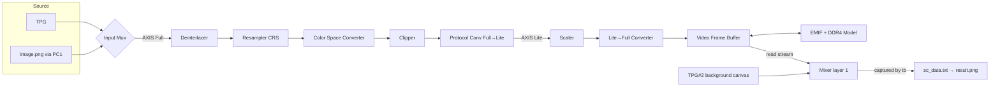

# Altera Video Processing Pipeline

The primary goal is to develop an integrated design using the Altera toolchain that successfully replicates the functionality of AMD's Video Processing Subsystem (VPSS) IP.

## Toolchain Specifications
Development and validation will be conducted using the following software environment:
- Synthesis & Implementation: Quartus 25.1
- Simulation: QuestaSim FPGA Starter Edition 21.1
- Target Device: Agilex 5 — `A5ED065BB32AE6SR0`

## Repository Structure

```
altera_video_pipeline/
├── Integrated_design/          # Full end-to-end pipeline simulation
│   ├── app/                    # GUI application & Python utilities
│   ├── rtl/                    # Simulation RTL sources (tb, top, capture)
│   ├── platform/               # Platform Designer (Qsys) IP system
│   └── quartus/                # Quartus project files
└── IPs/                        # Independent IP validation testbenches
    ├── clipper_axisfull_reconfigurable/
    ├── csc_axisfull_reconfigurable/
    ├── deinterlacer_axisfull_rgb_only/
    ├── mixer/
    ├── protocol_converter/
    ├── resampler_II_avalon_fixed/
    ├── resampler_axisfull_1ppc_fixed/
    ├── scaler_axislite_reconfigurable/
    ├── tpg_full_mode_configurable/
    └── ColorSpace/
```

---

## 1. Integrated Design (`Integrated_design/`)

### Architecture Overview

The pipeline processes a source frame (TPG pattern or a user-supplied `image.png`), buffers the scaled result in **DDR4 memory through an EMIF**, and composites it as a **Mixer** overlay on a solid-color background canvas. The mixer output is what the testbench captures.



### Component Breakdown

| Component | Functionality | Configuration | Control Access |
| :--- | :--- | :--- | :--- |
| **Test Pattern Generator (TPG)** | Source generation | Dynamic resolution, AXI4-Stream Full mode | Own Avalon-MM port |
| **Protocol Converter 1 (PC1)** | Image-file input path | Converts the `image.png` AXIS-Lite stream (played by the testbench) to Full; selected with `INPUT_SEL=1` | Own Avalon-MM port |
| **Deinterlacer (DIL)** | Scan conversion | Interlaced → progressive | Not reconfigurable |
| **Chroma Resampler (CRS)** | Chroma resampling | Runtime output mode (YUV 4:2:2 / 4:4:4) + commit | Bridge `0x800` |
| **Color Space Converter (CSC)** | Color space conversion | Runtime Q10.21 coefficient/summand writes; 5 preset modes in `top.v` (passthrough, RGB↔YCbCr BT.709/BT.601) | Bridge `0xA00` |
| **Clipper** | Spatial cropping | Top/Bottom/Left/Right offsets with commit register | Bridge `0x600` |
| **Protocol Converter 0 (PC0)** | Interface adaptation | AXI4-Stream Full → Lite ahead of the Scaler | Internal |
| **Scaler** | Resolution scaling | Runtime input & output dimensions | Bridge `0x400` |
| **Lite-to-Full Converter** | Interface adaptation | Regenerates in-band image-info packets (must match scaler output) so the frame buffer can consume the stream | Bridge `0x200` |
| **Video Frame Buffer (VFB)** | Frame buffering in DDR4 | Writes frames to external memory through the EMIF; read side starts only after `OUTPUT_CONTROL.GO` is set | Bridge `0x000` |
| **EMIF + DDR4 model** | External memory | Agilex 5 EMIF with a DDR4 simulation memory model (`pipeline_emif_0` / `pipeline_mem_0`); calibration runs at sim start | — |
| **Mixer** | Compositing | Layer 1 (VFB read frame) enabled/opaque and centered on the background canvas; layer 0 is the canvas | Bridge `0xC00` |
| **TPG#2** | Mixer background canvas | Uniform solid-color pattern at `MIXER_W × MIXER_H` (defines the mixer output size) | Bridge `0x1000` |

### Control Architecture (`mm_bridge_0`)

TPG and PC1 keep their own exported Avalon-MM control ports. All other IPs are reached through a single **Avalon-MM Pipeline Bridge** inside `pipeline.qsys` — only the bridge slave (`mm_bridge_0_s0`, 13-bit byte address, 32-bit data) is exposed. Per-IP register offsets are UG-20344 byte offsets (`word_addr << 2`) ORed with the slave base:

| Base (byte) | Slave |
| :--- | :--- |
| `0x000` | Video Frame Buffer |
| `0x200` | Lite-to-Full Converter |
| `0x400` | Scaler |
| `0x600` | Clipper |
| `0x800` | Chroma Resampler |
| `0xA00` | Color Space Converter |
| `0xC00` | Mixer (0x400 span) |
| `0x1000` | TPG#2 |

The mixer and TPG#2 bases are pinned explicitly in `platform/add_mixer.tcl` so the map does not shift when the system is regenerated.

### RTL Files (`rtl/`)

| File | Description |
| :--- | :--- |
| `tb.v` | Top-level testbench — includes `../app/configuration.vh`, drives the 100 MHz system clock and 200 MHz EMIF reference clock, captures the **mixer output** frame via `make_file`, plays `image_data.txt` into PC1 when `INPUT_SEL=1`, traces FSM state changes, and enforces a resolution-scaled watchdog with a 1 ms DDR4-calibration margin |
| `top.v` | DUT wrapper — instantiates the Platform Designer subsystem and implements the full Avalon-MM configuration FSM (TPG → Clipper → Scaler → CRS → CSC → Converter → VFB GO → Mixer → TPG#2 → [PC1] → WORKING); holds CSC coefficient ROMs for the 5 conversion modes; gates source data flow until configuration completes |
| `make_file.v` | Parametric AXI4-Stream sink — instantiates `frame_controller`, opens a hex file and writes one complete frame; supports Full (`IS_FULL=1`) and Lite (`IS_FULL=0`) stream modes |
| `controller.v` | `frame_controller` module — tracks pixel/line counts, detects Start-of-Frame (`tuser[0]`), skips in-band image-info metadata packets (`tuser[1]`, multi-beat), and asserts `write_flag` only for valid pixels of the **first** frame; signals `frame_done` |

#### `top.v` Configuration Sequence

```
Reset ──► TPG        resolution / pattern / commit / enable, poll status   (own port)
     ──► CLIPPER     input size, color space, subsampling, offsets, commit (bridge)
     ──► SCALER      input size (clipped), output size                     (bridge)
     ──► CRS         output mode, commit                                   (bridge)
     ──► CSC         12 coefficient/summand regs, output CS, commit, poll  (bridge)
     ──► CONVERTER   image info = scaler output dims, start                (bridge)
     ──► VFB         OUTPUT_CONTROL.GO — read side starts emitting         (bridge)
     ──► MIXER       layer 1 enable / opaque / centered offsets, commit    (bridge)
     ──► TPG#2       MIXER_W×MIXER_H uniform color, commit, enable, poll   (bridge)
     ──► [PC1]       image-source dims + start (only if INPUT_SEL=1)       (own port)
     ──► WORKING     pipeline live; tb captures the mixer output frame
```

The VFB read stream is started **before** the mixer background TPG#2 so the overlay is already present in the first composited frame.

### App Folder (`app/`)

A native **GTK3 desktop application** providing a dark-themed control panel for the full pipeline. It configures video parameters, triggers the simulation, and displays results — all in one window.

| File | Description |
| :--- | :--- |
| `image_viewer.py` | Main GUI — input source selector (TPG or `image.png`), parameter sidebar (TPG resolution, Clipper offsets, Scaler output, **Mixer canvas size**), debug-mode checkbox (opens QuestaSim GUI instead of console run), and result viewer |
| `runProject.py` | Generates a QuestaSim `run_sim.do` script using relative paths, then runs `vsim -c` (console) or `vsim -gui` (debug mode). Requires `QUARTUS_INSTALL_DIR` and `QUESTASIM_INSTALL_DIR` environment variables |
| `hex_to_png.py` | Parses `sc_data.txt` 24-bit hex pixels into `result.png` using OpenCV; dimensions are the **mixer** canvas size read from `pipeline_config.txt` |
| `png_to_hex.py` | Converts `image.png` to `image_data.txt` for the image-file input path |
| `configuration.vh` | Auto-generated by the GUI — Verilog parameters (`DEBUG_MODE`, `INPUT_SEL`, `TPG_*`, `CLIPPER_*`, `SCALER_*`, `MIXER_*`) included by `tb.v` |
| `pipeline_config.txt` | Auto-generated by the GUI — `key = value` parameter file read by `hex_to_png.py` |
| `tpg.png` / `image.png` | Reference input images shown in the GUI (per selected source) |

#### Launch the Application

```bash
export QUARTUS_INSTALL_DIR=/path/to/quartus
export QUESTASIM_INSTALL_DIR=/path/to/questasim
cd Integrated_design/app
python3 image_viewer.py
```

Headless (no GUI) run with the current `configuration.vh`:

```bash
cd Integrated_design/app
python3 runProject.py False   # False = console mode, True = QuestaSim GUI
python3 hex_to_png.py         # sc_data.txt → result.png
```

#### Workflow

1. **Select Input Source** — TPG pattern or `image.png` (its resolution is auto-detected and locks the input dimensions).
2. **Set Parameters** — TPG Width/Height, Clipper offsets, Scaler output dimensions, and the Mixer canvas size (must be ≥ the scaler output; the scaled frame is centered on it).
3. **Apply Settings** — saves `configuration.vh` + `pipeline_config.txt`, launches QuestaSim, and converts the captured mixer frame to `result.png`.
4. **View Results** — the status badge updates to `IMAGE READY` and `result.png` is displayed with its dimensions.

> **Note on simulation time:** with the EMIF + DDR4 model in the loop, DDR4 initialization/calibration consumes ~1 ms of simulated time before the first frame can round-trip through memory. Full runs take **hours of wall-clock time**, not minutes — keep resolutions small (e.g. 10×10 TPG, 20×20 mixer canvas) for functional checks.

### Simulation Output Files

| File | Written by | Contents |
| :--- | :--- | :--- |
| `app/sc_data.txt` | `make_file` (mixer output tap) | One complete composited frame at mixer-canvas resolution, 24-bit hex |
| `app/result.png` | `hex_to_png.py` | Final RGB image; dimensions taken from `mixer_w`/`mixer_h` in `pipeline_config.txt` |

## 2. Independent IP Testing (`IPs/`)

Each subdirectory contains a self-contained simulation environment for validating a single Intel VVP IP in isolation.

### `clipper_axisfull_reconfigurable/`

Validates the **AXI4-Stream Full Clipper IP** in a reconfigurable setup. A TPG feeds a full-resolution stream into the Clipper, which extracts a user-defined active region. Runtime configuration is done via Avalon-MM with a commit register, and the output stream is monitored for valid SOF/EOL framing.

| Parameter | Value |
| :--- | :--- |
| Interface | AXI4-Stream Full |
| Output Data Width | 24 bits (RGB) |
| Left Offset | 4 pixels |
| Top Offset | 4 pixels |
| Right Offset | 4 pixels |
| Bottom Offset | 4 pixels |
| Configuration | Avalon-MM with commit register (`0x144` byte / `0x51` word) |
| Clock | 100 MHz |

| Register (Word Addr) | Description |
| :--- | :--- |
| `0x49` – `IMG_INFO_HEIGHT` | Input lines per frame |
| `0x48` – `IMG_INFO_WIDTH` | Input pixels per line |
| `0x4C` – `IMG_INFO_COLOR_SPC` | Input color space |
| `0x4D` – `IMG_INFO_CHROMA_SUB` | Input chroma subsampling |
| `0x52` – `LEFT_OFFSET` | Left crop offset |
| `0x53` – `TOP_OFFSET` | Top crop offset |
| `0x54` – `RIGHT_OFFSET` | Right crop offset |
| `0x55` – `BOTTOM_OFFSET` | Bottom crop offset |
| `0x51` – `COMMIT` | Commit configuration |

### `csc_axisfull_reconfigurable/`

Validates the **Color Space Converter IP** with runtime coefficient programming over Avalon-MM. The 3×3 coefficient matrix and summands are written in Q10.21 fixed-point format, followed by a commit and a status poll.

### `deinterlacer_axisfull_rgb_only/`

Validates the **Deinterlacer IP** operating on an AXI4-Stream Full interface with RGB-only pixel data. The testbench captures one full progressive output frame to `video_dump.hex` and validates per-line pixel counts against expected dimensions.

| Parameter | Value |
| :--- | :--- |
| Interface | AXI4-Stream Full |
| Output Data Width | 24 bits (RGB) |
| Input Resolution | 20 × 10 (Width × Height) |
| Color Format | RGB only |
| Output | `video_dump.hex` (one captured frame) |
| Clock | 100 MHz |

### `mixer/`

Validates the **Mixer IP** compositing multiple TPG sources (up to 8 overlay layers on a background canvas). Layer registers (mode/enable, blend mode, static alpha, H/V offset) are programmed at runtime via Avalon-MM followed by a commit. Overlay sources are started before the background source so the first composited frame is complete.

### `protocol_converter/`

Validates the **Protocol Converter IP** bridging AXI4-Stream Full and Lite variants, including generation of in-band image-info packets.

### `resampler_II_avalon_fixed/`

Validates the **Chroma Resampler II IP** using an **Avalon-ST** interface with fixed configuration. The design feeds a TPG stream through the resampler and compares the output against expected resampled chroma values.

| Parameter | Value |
| :--- | :--- |
| Input Data Width | 32 bits |
| Output Data Width | 48 bits |
| Interface | Avalon-ST |

### `resampler_axisfull_1ppc_fixed/`

Validates the **Chroma Resampler II IP** using an **AXI4-Stream Full** interface at **1 pixel per clock (1ppc)**. Features a FIFO-based `resampling_checker.v` that decouples itself from the resampler's pipeline latency and includes a Python script (`create_image.py`) to reconstruct a PPM image from the simulation output.

| Parameter | Value |
| :--- | :--- |
| Sampling Conversion | YUV 4:2:2 → 4:4:4 |
| Interface | AXI4-Stream Full |
| Throughput | 1 pixel per clock |

### `scaler_axislite_reconfigurable/`

Validates the **Intel VVP Scaler IP** in **Lite Mode** with a reconfigurable output resolution. The testbench programs the Scaler at runtime via Avalon-MM register writes and a `vid_checker` verifies the output dimensions.

| Register (Word Addr) | Description |
| :--- | :--- |
| `0x48` – `IMG_INFO_WIDTH` | Input pixels per line (from TPG) |
| `0x49` – `IMG_INFO_HEIGHT` | Input lines per frame (from TPG) |
| `0x52` – `OUTPUT_WIDTH` | Target output pixels per line |
| `0x53` – `OUTPUT_HEIGHT` | Target output lines per frame |
