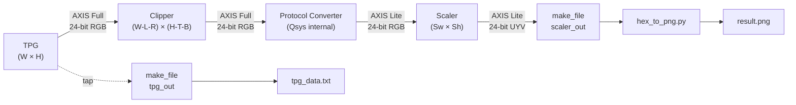

# Altera Video Processing Pipeline

A high-performance video processing pipeline implemented using Altera Video and Vision Processing (VVP) IPs. This project demonstrates a complete chain from generation to scaling, featuring automated protocol conversion, runtime register programming via Avalon-MM, and a GTK3 desktop GUI that drives the full simulation-to-image workflow.

## Repository Structure

```
altera_video_pipeline/
├── Integrated_design/          # Full end-to-end pipeline simulation
│   ├── app/                    # GUI application & Python utilities
│   │   ├── image_viewer.py     # Native GTK3 control panel & image viewer
│   │   ├── runProject.py       # Generates .do script and launches QuestaSim (console mode)
│   │   ├── hex_to_png.py       # Converts simulation hex output to PNG using OpenCV
│   │   ├── png_to_hex.py       # Utility: converts PNG to hex format
│   │   └── tpg.png             # Reference test pattern image (displayed on startup)
│   ├── rtl/                    # Simulation RTL sources
│   │   ├── tb.v                # Top-level testbench
│   │   ├── top.v               # DUT wrapper + Avalon-MM configuration state machine
│   │   ├── make_file.v         # AXI4-Stream sink: captures one frame and writes hex data
│   │   └── controller.v        # Frame controller: pixel/line counting & write-flag logic
│   ├── platform/               # Platform Designer (Qsys) IP system
│   └── quartus/                # Quartus project files
└── IPs/                        # Independent IP validation testbenches
    ├── clipper_axisfull_reconfigurable/
    ├── deinterlacer_axisfull_rgb_only/
    ├── resampler_II_avalon_fixed/
    ├── resampler_axisfull_1ppc_fixed/
    └── scaler_axislite_reconfigurable/
```

---

## 1. Integrated Design (`Integrated_design/`)

### Architecture Overview

The integrated pipeline implements the following data flow. All dimensions are parametric and driven by the GUI at runtime:



**Key gating behaviour:** AXI-Stream data from the TPG is held back until the Avalon-MM configuration sequence for the Clipper and Scaler is fully complete (`STATE_WORKING`). This ensures IPs never receive video before their registers are programmed.

### Component Breakdown

| Component | Functionality | Configuration |
| :--- | :--- | :--- |
| **Test Pattern Generator (TPG)** | Source generation | Configurable resolution, AXI4-Stream Full mode |
| **Clipper** | Spatial cropping | Extracts active region with Top/Bottom/Left/Right offsets; programmed via Avalon-MM with commit register (`0x51`) |
| **Protocol Converter** | Interface adaptation | Internal Qsys component; bridges AXI4-Stream Full metadata to AXI4-Stream Lite |
| **Scaler** | Resolution reduction | Performs high-quality downscaling; programmed via Avalon-MM (input & output dimensions) |
| **make_file** | Data capture | AXI4-Stream sink; instantiates `frame_controller` to track frame boundaries and write pixel hex data to file |

### RTL Files (`rtl/`)

| File | Description |
| :--- | :--- |
| `tb.v` | Top-level testbench — includes `configuration.vh`, drives clock/reset, instantiates two `make_file` taps (TPG & Scaler), waits for `frame_done1 && frame_done2`, and enforces a resolution-scaled timeout watchdog |
| `top.v` | DUT wrapper — instantiates the Platform Designer subsystem AND implements the 3-state Avalon-MM configuration FSM (`CONFIG_CLIP → CONFIG_SCALER → WORKING`); gates TPG data flow until configuration is complete |
| `make_file.v` | Parametric AXI4-Stream sink — instantiates `frame_controller` for SOF/line detection, opens a hex file and writes one complete frame; supports both Full (`IS_FULL=1`) and Lite (`IS_FULL=0`) stream modes |
| `controller.v` | `frame_controller` module — tracks pixel and line counts, detects Start-of-Frame (`tuser[0]`), and asserts `write_flag` only for valid in-bounds pixels of the **first** frame; signals `frame_done` at end of frame |

#### `top.v` Configuration State Machine

```
Reset ──► STATE_CONFIG_CLIP (0)
              │  8 Avalon-MM writes: Width, Height, Color, Chroma,
              │  Left/Top/Right/Bottom offsets → Commit (0x51)
              ▼
         STATE_CONFIG_SCALER (1)
              │  4 Avalon-MM writes: Input W/H (clipped size), Output W/H
              ▼
         STATE_WORKING (2)
              │  TPG → Clipper data flow enabled; simulation captures frames
```

### App Folder (`app/`)

A native **GTK3 desktop application** providing a dark-themed control panel for the full pipeline. It configures video parameters, triggers the simulation, and displays results — all in one window.

| File | Description |
| :--- | :--- |
| `image_viewer.py` | Main GUI — parameter sidebar (TPG, Clipper, Scaler), image viewer (shows `tpg.png` on startup, `result.png` after a successful run), and pipeline control |
| `runProject.py` | Generates a QuestaSim `.do` script using **relative paths** derived from the script's own location, then executes `vsim -c` (console/batch mode) |
| `hex_to_png.py` | Reads `pipeline_config.txt` to obtain scaler dimensions dynamically; parses `sc_data.txt` 24-bit **U-Y-V** hex pixels and converts to `result.png` using OpenCV |
| `png_to_hex.py` | Utility to convert a PNG image to a hex file for hardware input |
| `configuration.vh` | Auto-generated by the GUI — Verilog `parameter` definitions (`TPG_WIDTH/HEIGHT`, `CLIPPER_*`, `SCALER_WIDTH/HEIGHT`) included directly by `tb.v` |
| `pipeline_config.txt` | Auto-generated by the GUI — human-readable `key = value` parameter file read by `hex_to_png.py` |
| `tpg.png` | Reference test pattern image displayed in the GUI on startup |


#### Launch the Application

```bash
cd Integrated_design/app
python3 image_viewer.py
```

#### Workflow

1. **Set Parameters** — Use the sidebar to configure TPG Width/Height, Clipper offsets (Top, Bottom, Left, Right), and Scaler output dimensions.
2. **Apply Settings** — Click **Apply Settings**. This:
   - Saves `configuration.vh` (Verilog header) and `pipeline_config.txt` (Python-readable config).
   - Launches QuestaSim in console mode (`vsim -c`) to compile and simulate the design.
   - Converts the simulation hex output (`sc_data.txt`) to `result.png` using `hex_to_png.py`.
3. **View Results** — The status badge updates to `IMAGE READY`. The `result.png` file is saved in the `app/` directory and its dimensions are shown in the viewer info bar.

### Simulation Output Files

| File | Written by | Contents |
| :--- | :--- | :--- |
| `app/tpg_data.txt` | `make_file` (`IS_FULL=1`, TPG tap) | Raw TPG pixel hex data — one complete frame at source resolution |
| `app/sc_data.txt` | `make_file` (`IS_FULL=0`, Scaler tap) | Raw Scaler pixel hex data — one complete frame in 24-bit U-Y-V hex format |
| `app/result.png` | `hex_to_png.py` | Final RGB image reconstructed from scaler output; dimensions taken from `pipeline_config.txt` |


## 2. Independent IP Testing (`IPs/`)

Each subdirectory contains a self-contained simulation environment for validating a single Intel VVP IP in isolation.

### `clipper_axisfull_reconfigurable/`

Validates the **AXI4-Stream Full Clipper IP** in a reconfigurable setup. A TPG feeds a full-resolution stream into the Clipper, which extracts a user-defined active region. Runtime configuration is done via Avalon-MM with a commit register, and the output stream is monitored for valid SOF/EOL framing.

| Parameter | Value |
| :--- | :--- |
| Interface | AXI4-Stream Full |
| Output Data Width | 24 bits (RGB) |
| Left Offset | 4 pixels |
| Top Offset | 4 pixels |
| Right Offset | 4 pixels |
| Bottom Offset | 4 pixels |
| Configuration | Avalon-MM with commit register (`0x144`) |
| Clock | 100 MHz |

### `deinterlacer_axisfull_rgb_only/`

Validates the **Deinterlacer IP** operating on an AXI4-Stream Full interface with RGB-only pixel data. The testbench captures one full progressive output frame to `video_dump.hex` and validates per-line pixel counts against expected dimensions.

| Parameter | Value |
| :--- | :--- |
| Interface | AXI4-Stream Full |
| Output Data Width | 24 bits (RGB) |
| Input Resolution | 20 × 10 (Width × Height) |
| Color Format | RGB only |
| Output | `video_dump.hex` (one captured frame) |
| Clock | 100 MHz |

### `resampler_II_avalon_fixed/`

Validates the **Chroma Resampler II IP** using an **Avalon-ST** interface with fixed configuration. The design feeds a TPG stream through the resampler and compares the output against expected resampled chroma values.

| Parameter | Value |
| :--- | :--- |
| Input Data Width | 32 bits |
| Output Data Width | 48 bits |
| Interface | Avalon-ST |

### `resampler_axisfull_1ppc_fixed/`

Validates the **Chroma Resampler II IP** using an **AXI4-Stream Full** interface at **1 pixel per clock (1ppc)**. Features a FIFO-based `resampling_checker.v` that decouples itself from the resampler's pipeline latency and includes a Python script (`create_image.py`) to reconstruct a PPM image from the simulation output.

| Parameter | Value |
| :--- | :--- |
| Sampling Conversion | YUV 4:2:2 → 4:4:4 |
| Interface | AXI4-Stream Full |
| Throughput | 1 pixel per clock |

### `scaler_axislite_reconfigurable/`

Validates the **Intel VVP Scaler IP** in **Lite Mode** with a reconfigurable output resolution. The testbench programs the Scaler at runtime via Avalon-MM register writes and a `vid_checker` verifies the output dimensions.

| Register (Word Addr) | Description |
| :--- | :--- |
| `0x48` – `IMG_INFO_WIDTH` | Input pixels per line (from TPG) |
| `0x49` – `IMG_INFO_HEIGHT` | Input lines per frame (from TPG) |
| `0x52` – `OUTPUT_WIDTH` | Target output pixels per line |
| `0x53` – `OUTPUT_HEIGHT` | Target output lines per frame |

