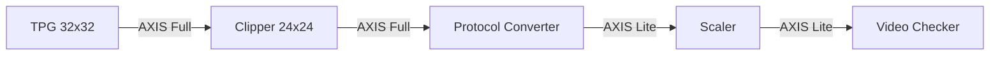

# Altera Video Processing Pipeline

A high-performance video processing pipeline implemented using Altera Video and Vision Processing (VVP) IPs. This project demonstrates a complete chain from generation to scaling, featuring automated protocol conversion and real-time dimension validation.

## Architecture Overview

The pipeline implements following logic:

### Component Breakdown

| Component | Functionality | Configuration |
| :--- | :--- | :--- |
| **Test Pattern Generator (TPG)** | Source generation | 32x32 resolution, AXI4-Stream Full mode |
| **Clipper** | Spatial cropping | Extracts a 24x24 active region from the 32x32 source |
| **Protocol Converter** | Interface adaptation | Bridges AXI4-Stream Full metadata to AXI4-Stream Lite |
| **Scaler** | Resolution reduction | Performs high-quality downscaling on the 24x24 input |
| **Video Checker** | Validation | Monitors output metadata and pixel counts to ensure integrity |

## Project Structure

- **`rtl/top.v`**: The top-level structural wrapper connecting the Platform Designer system with the validation logic.
- **`rtl/vid_checker.v`**: A robust validation module that tracks `tuser[0]` (Start of Frame) and `tlast` (End of Line) to verify spatial dimensions.
- **`rtl/testbench.v`**: The simulation harness providing clock, reset, and Avalon-MM configuration for the Scaler IP.
- **`platform/system.qsys`**: The Platform Designer (Qsys) source defining the IP interconnect and configuration.

## Configuration and Simulation

The system is designed for modularity. Input and output resolutions can be adjusted via the `testbench.v` parameters.

### Validation Flow
1. **Reset**: System initializes with a synchronous reset.
2. **Configuration**: The Scaler is programmed via its Avalon-MM interface to expect a 24x24 input and produce the target downscaled output.
3. **Stream Processing**: Video data flows through the pipeline.
4. **Automated Check**: The `vid_checker` monitors the final output, asserting `check_pass` upon successful frame verification.

