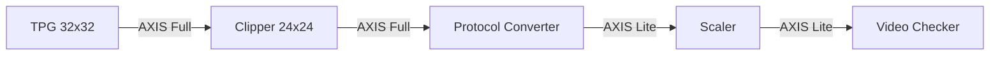

# Altera Video Processing Pipeline

A high-performance video processing pipeline implemented using Altera Video and Vision Processing (VVP) IPs. This project demonstrates a complete chain from generation to scaling, featuring automated protocol conversion and real-time dimension validation.

## Repository Structure

The repository is organized into two top-level directories:

```
altera_video_pipeline/
├── Integrated_design/      # Full end-to-end pipeline simulation
└── IPs/                    # Independent IP validation testbenches
    ├── clipper_axisfull_reconfigurable/
    ├── deinterlacer_axisfull_rgb_only/
    ├── resampler_II_avalon_fixed/
    ├── resampler_axisfull_1ppc_fixed/
    └── scaler_axislite_reconfigurable/
```

---

## 1. Integrated Design (`Integrated_design/`)

### Architecture Overview

The integrated pipeline implements the following data flow:



### Component Breakdown

| Component | Functionality | Configuration |
| :--- | :--- | :--- |
| **Test Pattern Generator (TPG)** | Source generation | 32x32 resolution, AXI4-Stream Full mode |
| **Clipper** | Spatial cropping | Extracts a 24x24 active region from the 32x32 source |
| **Protocol Converter** | Interface adaptation | Bridges AXI4-Stream Full metadata to AXI4-Stream Lite |
| **Scaler** | Resolution reduction | Performs high-quality downscaling on the 24x24 input |
| **Video Checker** | Validation | Monitors output metadata and pixel counts to ensure integrity |

### Key Files

| File | Description |
| :--- | :--- |
| `rtl/top.v` | Top-level structural wrapper connecting the Platform Designer system with validation logic |
| `rtl/vid_checker.v` | Validation module tracking `tuser[0]` (SOF) and `tlast` (EOL) to verify spatial dimensions |
| `rtl/testbench.v` | Simulation harness providing clock, reset, and Avalon-MM configuration for the Scaler IP |
| `platform/system.qsys` | Platform Designer (Qsys) source defining the IP interconnect and configuration |

### Validation Flow

1. **Reset**: System initializes with a synchronous reset.
2. **Configuration**: The Scaler is programmed via Avalon-MM to expect a 24x24 input and produce the target downscaled output.
3. **Stream Processing**: Video data flows end-to-end through the pipeline.
4. **Automated Check**: `vid_checker` monitors the final output, asserting `check_pass` upon successful frame verification.

---

## 2. Independent IP Testing (`IPs/`)

Each subdirectory contains a self-contained simulation environment for validating a single Intel VVP IP in isolation.

### `clipper_axisfull_reconfigurable/`

Validates the **AXI4-Stream Full Clipper IP** in a reconfigurable setup. A TPG feeds a full-resolution stream into the Clipper, which extracts a user-defined active region. Runtime configuration is done via Avalon-MM with a commit register, and the output stream is monitored for valid SOF/EOL framing.

| Parameter | Value |
| :--- | :--- |
| Interface | AXI4-Stream Full |
| Output Data Width | 24 bits (RGB) |
| Left Offset | 4 pixels |
| Top Offset | 4 pixels |
| Right Offset | 4 pixels |
| Bottom Offset | 4 pixels |
| Configuration | Avalon-MM with commit register (`0x144`) |
| Clock | 100 MHz |

### `deinterlacer_axisfull_rgb_only/`

Validates the **Deinterlacer IP** operating on an AXI4-Stream Full interface with RGB-only pixel data. The testbench captures one full progressive output frame to `video_dump.hex` and validates per-line pixel counts against expected dimensions.

| Parameter | Value |
| :--- | :--- |
| Interface | AXI4-Stream Full |
| Output Data Width | 24 bits (RGB) |
| Input Resolution | 20 × 10 (Width × Height) |
| Color Format | RGB only |
| Output | `video_dump.hex` (one captured frame) |
| Clock | 100 MHz |

### `resampler_II_avalon_fixed/`

Validates the **Chroma Resampler II IP** using an **Avalon-ST** interface with fixed configuration. The design feeds a TPG stream through the resampler and compares the output against expected resampled chroma values.

| Parameter | Value |
| :--- | :--- |
| Input Data Width | 32 bits |
| Output Data Width | 48 bits |
| Interface | Avalon-ST |

### `resampler_axisfull_1ppc_fixed/`

Validates the **Chroma Resampler II IP** using an **AXI4-Stream Full** interface at **1 pixel per clock (1ppc)**. Features a FIFO-based `resampling_checker.v` that decouples itself from the resampler's pipeline latency and includes a Python script (`create_image.py`) to reconstruct a PPM image from the simulation output.

| Parameter | Value |
| :--- | :--- |
| Sampling Conversion | YUV 4:2:2 → 4:4:4 |
| Interface | AXI4-Stream Full |
| Throughput | 1 pixel per clock |

### `scaler_axislite_reconfigurable/`

Validates the **Intel VVP Scaler IP** in **Lite Mode** with a reconfigurable output resolution. The testbench programs the Scaler at runtime via Avalon-MM register writes and a `vid_checker` verifies the output dimensions.

| Register (Word Addr) | Description |
| :--- | :--- |
| `0x48` – `IMG_INFO_WIDTH` | Input pixels per line (from TPG) |
| `0x49` – `IMG_INFO_HEIGHT` | Input lines per frame (from TPG) |
| `0x52` – `OUTPUT_WIDTH` | Target output pixels per line |
| `0x53` – `OUTPUT_HEIGHT` | Target output lines per frame |
